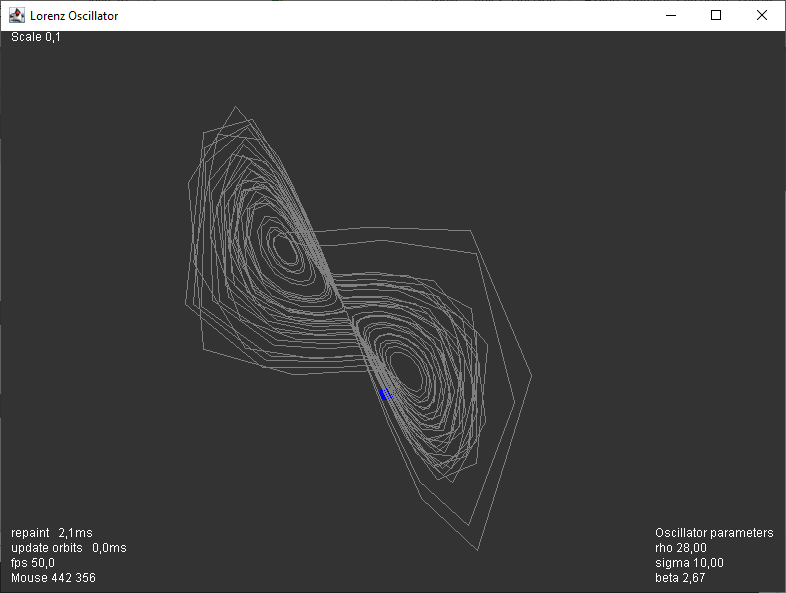

# Lorenz Oscillator

Simple interactive implementation of a Lorenz oscillator.

Currently only plotting x and y, although z is calculated.

# keys

  * `p` pause
  * `o` toggle show orbits
  * `e` erase orbits
  * `up` and `down` increase and decrease rho
  * `right` and `left` increase and decrease sigma

# Download 

Get the JAR file under [Actions](https://github.com/haphaeu/Lorenz/actions)

# Project Status

